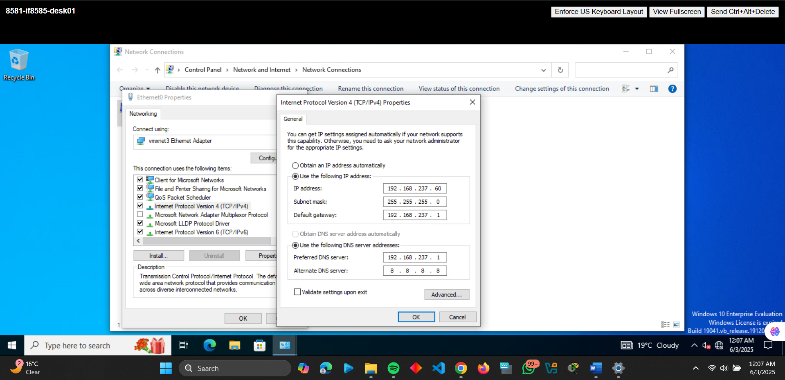
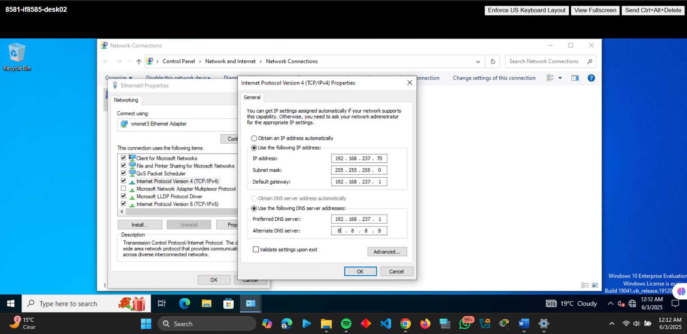

# Secure Network Administration Projects

This repository documents three hands-on projects implementing enterprise-grade network security using **pfSense firewalls, port forwarding**. Each project includes detailed configurations, annotated screenshots, and key learnings.

---

## **Project 1: Enterprise Firewall Deployment with pfSense**
### **Overview**
Deployed a pfSense firewall to segment WAN (external) and LAN (internal) traffic in a virtualized environment, enabling secure internet access for internal devices.

### **Implementation Steps & Screenshots**
1. **pfSense VM Configuration**  
   - Assigned WAN: `10.174.237.25/24` (Adapter: `network01`)  
   - Assigned LAN: `192.168.237.1/24` (Adapter: `network02`) with DHCP range `192.168.237.35-50`  
     
   *Static IP assignment via console.*

2. **Windows 10 Client Deployment**  
   - **Fix**: Enabled DHCP on pfSense LAN interface and repaired Windows network settings:  
     
   *Assigned IP: `192.168.237.35`.*

3. **Validation**  
   - Ping tests from Windows client to WAN (`10.174.237.25`) and Google (`8.8.8.8`):  
     
   *4/4 packets received confirms proper routing.*

### **Key Challenges**
- **DHCP Misconfiguration**: Required manual intervention on Windows client.  
- **Interface Assignment**: Critical to bind WAN/LAN to correct adapters (`network01`/`network02`).

---

## **Project 2: Secure Remote Access via Port Forwarding**
### **Overview**
Enabled external RDP access to two internal Windows VMs (`desk01`/`desk02`) through pfSense NAT rules.

### **Step-by-Step with Screenshots**
1. **Static IP Assignment**  
   - `desk01`: `192.168.237.60`  
     
   - `desk02`: `192.168.237.70`  
     

2. **pfSense NAT Rules**  
   - Forwarded external ports to internal RDP (3389):  
     - `3399` → `192.168.237.60:3389`  
     - `3400` → `192.168.237.70:3389`  
     

3. **Connection Test**  
   - Successful RDP from home PC to both VMs:  
     
     

### **Lessons Learned**
- **Windows Firewall**: Must be disabled for external RDP during testing.  
- **RFC 1918 Blocking**: Disabled on pfSense WAN to allow private IP traffic (e.g., VPN).

---

## **How to Reproduce**
1. Download [pfSense ISO](https://www.pfsense.org/download/).  
2. Set up VMs with WAN/LAN interfaces as described.  
3. Refer to screenshots for troubleshooting.  

---
