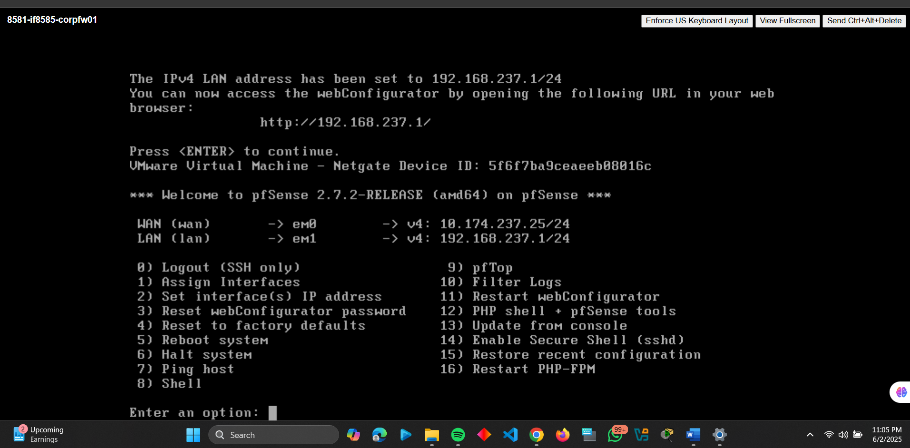
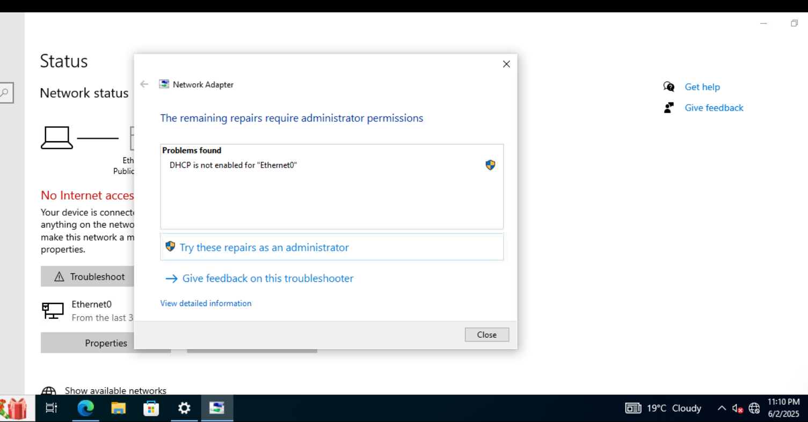
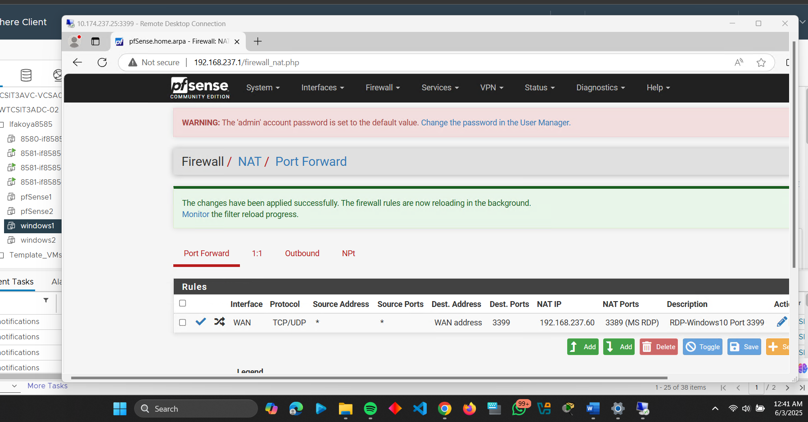
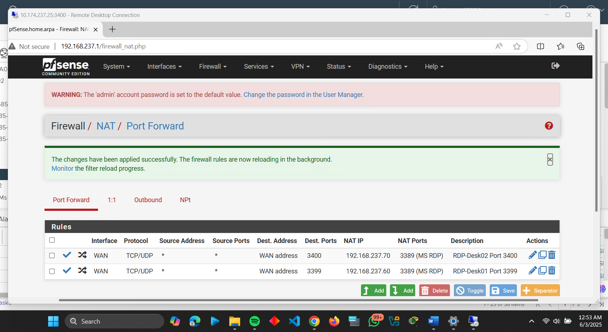

# Secure Network Administration Project

This repository documents three hands-on projects focused on network security using pfSense firewalls, port forwarding. Each includes configurations, screenshots, and reflections.

---

## **Project 1: pfSense Firewall Deployment**
### **Overview**
Deployed a pfSense firewall in a virtualized environment to segment and secure internal (LAN) and external (WAN) traffic. Key tasks included:
- Configuring WAN (`10.174.237.25/24`) and LAN (`192.168.237.1/24`) interfaces.
- Enabling DHCP for internal devices.
- Validating connectivity between LAN and WAN via ping tests.

### **Key Screenshots**
1. **pfSense CLI Setup**:  
   
   *Assigned static IPs to WAN/LAN interfaces.*  

2. **Windows 10 DHCP Fix**:  
     
   *Resolved "DHCP not enabled" error on the Windows VM.*

3. **Validating Connection**:  
     
   *Pinging Google's IP Address from the Windows VM.*
   
### **Challenges & Solutions**
- **Mistyped LAN IP**: Corrected during CLI setup.  
- **DHCP Issues**: Enabled DHCP on pfSense and repaired Windows network settings.  

---

## **Project 2: Port Forwarding for Remote Desktop**
### **Overview**
Configured pfSense to forward external RDP traffic to two internal Windows machines:
- **desk01**: `10.174.237.25:3399` → `192.168.237.60:3389`  
- **desk02**: `10.174.237.25:3400` → `192.168.237.70:3389`  

### **Key Steps**
1. Assigned static IPs to Windows VMs.  
2. Created NAT rules in pfSense.  
3. Disabled Windows Defender Firewall for testing.  

### **Screenshots**
- **NAT Rules**:  
    
- **Successful RDP Connection**:  
    

### **Lessons Learned**
- RFC 1918 blocking can interfere with VPN connections; disabled it for testing.  

---

## **How to Reproduce**
1. Download [pfSense ISO](https://www.pfsense.org/download/).  
2. Set up VMs with WAN/LAN interfaces as described.  
3. Refer to screenshots for troubleshooting.  

---
